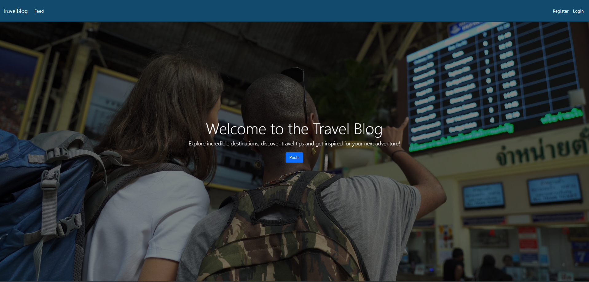

# Travel Blog Project

Welcome to the Travel Blog Project! This is an ASP.NET web application where users can share their travel experiences, post images, and add tags to their posts.


## Features

- **User Registration and Authentication**: Users can sign up and log in to the application.
- **Create, Read, Update, Delete (CRUD) Operations**: Users can create, view, edit, and delete their travel posts.
- **Image Upload**: Users can upload images to their travel posts.
- **Tagging**: Users can add tags to their posts to categorize their travel experiences.

## Technologies Used

- **ASP.NET Core**: Backend framework for building web applications.
- **Entity Framework Core**: ORM for database operations.
- **SQL Server**: Database for storing user data and posts.
- **Bootstrap**: Frontend framework for responsive design.
- **jQuery**: JavaScript library for DOM manipulation and AJAX requests.

## Getting Started

### Prerequisites

- [.NET 6.0 SDK](https://dotnet.microsoft.com/download/dotnet/6.0)
- [SQL Server](https://www.microsoft.com/en-us/sql-server/sql-server-downloads)

### Installation

1. **Clone the repository**
   ```bash
   git clone https://github.com/yourusername/travel-blog.git
   cd travel-blog
